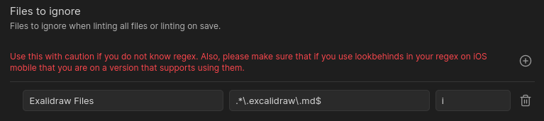

# Ignoring or Disabling Rules

There are a couple of way to ignore rules in the Linter. These vary from settings in the plugin itself
to values in the YAML frontmatter, and a syntax to ignore rules for part or all of a file.

## Ignoring a Folder

There is a setting in the plugin for called `Folders to Ignore`. As the name suggests, this rule is meant
to allow users to specify folders that they do not want the linting rules to affect.
The values in the text box are expected to be folder paths from the base of the Obsidian vault.


For example, in the above image, the `templates` folder will be ignored when the Linter attempts to run its rules. Nested folders are also allowed as well.

## Ignoring Files via Regex

There is a setting in this plugin which allows you to be able to ignore files by providing a regex to match against.
If a file matches the provided regex, it will go ahead and ignore that file before it even lints the file.



For example, in the above image you can see that Excalidraw files which end in `.exclidraw.md` are being ignored
using the regex `.*\.excalidraw\.md$`.

## File Specific Rule Disabling

There are times when there may be a need to disable a specific rule or rules for a particular file and there is no
desire to ignore all files in the folder where that file resides. In that case, there is the ability to disable a
rule or rules via the YAML frontmatter or ranged ignores.

### YAML Frontmatter

In the YAML frontmatter of a file, there is the ability to specify a list of rules to disable for the file using the key `disabled rules`.
Valid values for rules to disable are the rule aliases to disable specific rules or `all` to disable all rules for the file.

For example, the following would disable [capitalize headings](../settings/heading-rules.md#capitalize-headings) and [header increment](../settings/heading-rules.md#header-increment) for the entire file it is found in:
``` markdown
---
disabled rules: [capitalize-headings, header-increment]
---
```

The following disables all Linter rules for a file:
``` markdown
---
disabled rules: [all]
---
```

### Comment Ignore Markers

Comment markers can disable rules for a block of lines or for the next line(s). Both HTML and Obsidian comments work:

`<!-- linter-disable ... -->`, `<!-- linter-enable ... -->`, `<!-- linter-disable-next-line ... -->`, `<!-- linter-disable-next-n-lines: N ... -->`

`%% linter-disable ... %%`, `%% linter-enable ... %%`, `%% linter-disable-next-line ... %%`, `%% linter-disable-next-n-lines: N ... %%`

A marker is recognized only when it is the only thing on the line (spaces or tabs around it are fine). Markers inside YAML frontmatter, fenced or indented code, inline code, or math blocks are ignored. Marker lines themselves are never changed by any rule.

A disable marker with no rule list turns off every rule for that scope. A comma-separated list of rule aliases turns off only those rules. Unknown names, empty entries, and trailing commas are ignored. If a listed disable has no known aliases left after that, the marker does nothing.

`linter-disable-next-line` and `linter-disable-next-n-lines: N` apply the same rule list to the next line or the next `N` lines. `N` must be a positive whole number. If there is no following line, the marker has no effect. A range that would run past the end of the file stops at the last line.

Disable scopes nest. A bare `linter-enable` closes the most recent open disable scope. An `linter-enable` with a rule list turns those rules back on by removing each of them from the nearest scope that currently disables it.

!!! warning
    These markers only protect the lines they apply to. They do not stop rules from adding or removing blank lines around a protected region.

``` markdown
Here is some text
<!-- linter-disable -->
                          This area will not be formatted
<!-- linter-enable -->
More content goes here...
%% linter-disable-next-line trailing-spaces %%
this line keeps its trailing spaces
%% linter-disable consecutive-blank-lines, trailing-spaces %%
                          extra blank lines and spaces stay
%% linter-enable trailing-spaces %%
spaces here are formatted again
%% linter-enable %%
```

Leaving off `linter-enable` keeps the disable in effect through the end of the file.

!!! info
    Paste rules are not affected by these markers. That would require the pasted text to include a marker.
